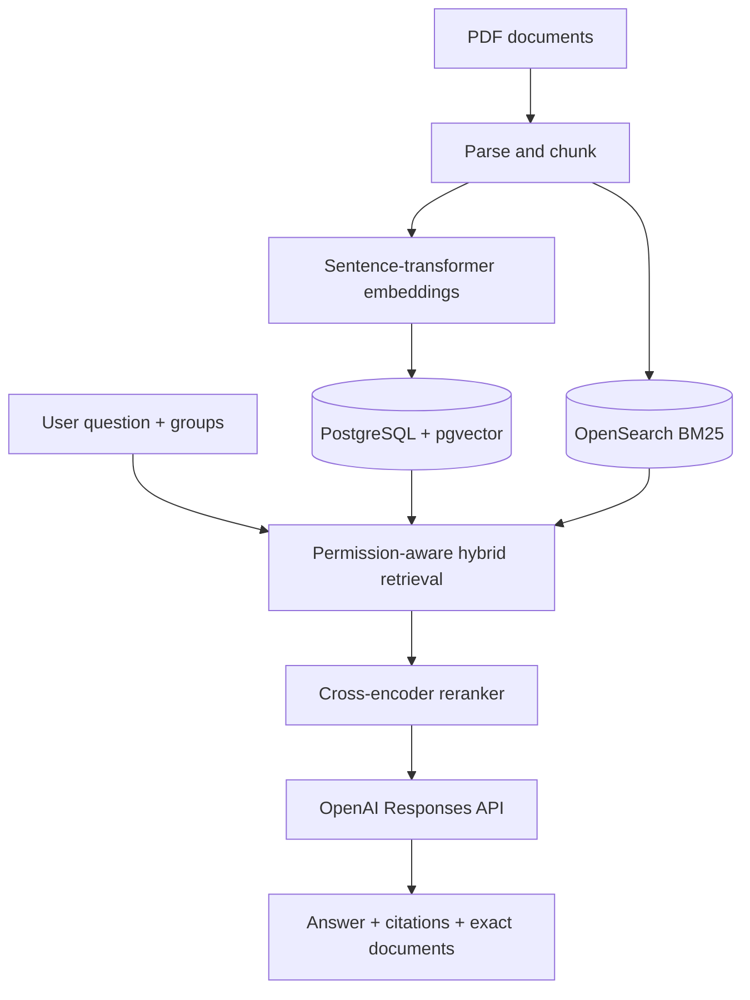

# JKU Knowledge Search

A miniature enterprise search/RAG system for authoritative university documents. It combines semantic retrieval, BM25, reciprocal-rank fusion, cross-encoder reranking, source-linked answers, document permissions, and retrieval evaluation.

## Architecture



Permission filters are applied independently to both retrieval paths before fusion and reranking.

## Windows + VS Code quick start

Prerequisites: Python 3.11 or 3.12, Git, Docker Desktop, and VS Code.

```powershell
git clone https://github.com/Aryamanjmwl/JKUAI.git
cd JKUAI
py -3.12 -m venv .venv
.\.venv\Scripts\Activate.ps1
python -m pip install --upgrade pip
pip install -e ".[cpu,dev]"
Copy-Item .env.example .env
docker compose up -d
alembic upgrade head
uvicorn app.main:app --app-dir backend --reload
```

Add your API key to `.env`; never commit that file. The official Python SDK reads API credentials from the environment. Open <http://localhost:8000/docs> to use the interactive API.

In a second VS Code terminal, start the web client:

```powershell
cd frontend
npm install
npm run dev
```

Open <http://localhost:5173>.

## Ingest a document

In Swagger, call `POST /documents` with a PDF, title, public URL, and visibility. Restricted documents must include comma-separated groups such as `staff,admissions`.

PowerShell example:

```powershell
curl.exe -X POST http://localhost:8000/documents `
  -F "file=@data/raw/module-handbook.pdf" `
  -F "title=JKU AI Module Handbook" `
  -F "source_url=https://example.jku.at/module-handbook.pdf" `
  -F "visibility=public"
```

## Search with permissions

```powershell
curl.exe -X POST http://localhost:8000/search `
  -H "Content-Type: application/json" `
  -H "X-User-Id: anushka" `
  -H "X-User-Groups: students" `
  -d '{"query":"Which courses do I need before taking Advanced Machine Learning?"}'
```

The response contains an answer with `[S1]` citations, source excerpts, page numbers, document links, exact document filenames, reranker scores, and end-to-end latency.

## Evaluate retrieval

Create 50 labelled JSONL rows from `evaluation/questions.example.jsonl`, then run:

```powershell
python evaluation/evaluate.py evaluation/questions.jsonl
```

It reports Recall@5, MRR, mean latency, and p95 latency. Answer-correctness judging is intentionally identified as the next evaluation milestone rather than reported with a fake score.

## Current scope

- PDF ingestion with SHA-256 duplicate detection
- Page-aware overlapping chunks
- 384-dimensional normalized embeddings
- Permission-aware pgvector and BM25 retrieval
- Reciprocal Rank Fusion and top-5 cross-encoder reranking
- OpenAI Responses API answer generation
- Inline citation contract and exact documents used
- Evaluation runner and unit tests
- Responsive React and TypeScript search interface

Next milestones: web crawler for public JKU pages, admin document dashboard, automated citation validation, LLM/human correctness scoring, and a 50-question benchmark.
