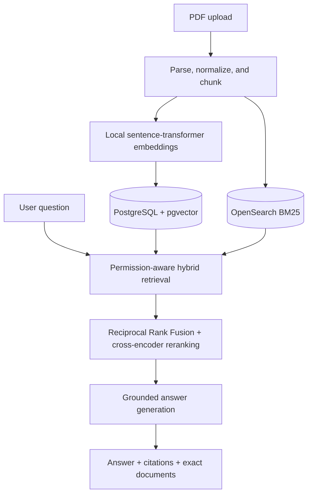

# JKUAI — University Knowledge Search

[](https://github.com/Aryamanjmwl/JKUAI/actions/workflows/ci.yml)
[](LICENSE)

JKUAI is a compact enterprise-search and retrieval-augmented generation system for university documents. It combines lexical and semantic retrieval, cross-encoder reranking, access-aware filtering, and source-linked answers.

The project is designed to answer questions such as:

> Which courses should I complete before taking Advanced Machine Learning?

Every answer is grounded in retrieved document passages and returned with citations, page numbers, source links, and the exact filenames used.

> [!NOTE]
> JKUAI is an independent portfolio project. It is not an official service of Johannes Kepler University Linz.

## Why this project

Enterprise search has requirements that a general chatbot does not address:

- exact terms and course identifiers must remain searchable;
- semantically similar wording must still retrieve the right passages;
- restricted content must be filtered before ranking and generation;
- answers must be traceable to authoritative documents; and
- retrieval quality must be measured independently from answer generation.

JKUAI implements these concerns as separate, testable stages rather than hiding them behind a single LLM call.

## System overview



Access filters are applied inside both retrieval paths before fusion and reranking. The system retrieves up to 20 candidates from each index, fuses the rankings with Reciprocal Rank Fusion, and reranks the merged candidates to the best five passages.

## Implemented capabilities

| Capability | Implementation | Status |
|---|---|---|
| PDF ingestion | Page-aware parsing, normalized text, overlapping chunks | Implemented |
| Duplicate detection | SHA-256 document checksum | Implemented |
| Semantic retrieval | 384-dimensional sentence-transformer embeddings in pgvector | Implemented |
| Lexical retrieval | BM25 over titles and chunk content in OpenSearch | Implemented |
| Hybrid ranking | Reciprocal Rank Fusion followed by cross-encoder reranking | Implemented |
| Grounded answers | OpenAI Responses API with inline source markers | Local demo |
| Source verification | Excerpts, page numbers, document links, and exact filenames | Implemented |
| Access filtering | Public-only by default; simulated groups behind an explicit developer flag | Implemented for demonstration |
| Retrieval evaluation | Recall@5, MRR, mean latency, and p95 latency | Runner implemented; benchmark pending |

## Technology stack

| Layer | Technology |
|---|---|
| API | Python 3.11+, FastAPI, Pydantic |
| Relational/vector store | PostgreSQL 16, pgvector, SQLAlchemy, Alembic |
| Lexical search | OpenSearch 2.19 |
| Embeddings | `sentence-transformers/all-MiniLM-L6-v2` |
| Reranker | `cross-encoder/ms-marco-MiniLM-L-6-v2` |
| Answer generation | OpenAI Responses API |
| Web client | React, TypeScript, Vite |
| Local infrastructure | Docker Compose |
| Quality checks | pytest, Ruff, GitHub Actions |

## Run locally on Windows

### Prerequisites

- Python 3.11 or 3.12
- Docker Desktop
- Node.js 22
- Git and PowerShell 7

### 1. Prepare the backend

```powershell
git clone https://github.com/Aryamanjmwl/JKUAI.git
cd JKUAI

py -3.11 -m venv .venv
.\.venv\Scripts\Activate.ps1
python -m pip install --upgrade pip
pip install -e ".[cpu,dev]"
Copy-Item .env.example .env
```

### 2. Start the indexes and API

```powershell
docker compose up -d
docker compose ps
alembic upgrade head
uvicorn app.main:app --app-dir backend --reload
```

The API is available at <http://localhost:8000>; interactive documentation is available at <http://localhost:8000/docs>.

### 3. Start the web client

Open a second PowerShell terminal:

```powershell
cd .\frontend
npm ci
npm run dev
```

Open <http://localhost:5173>.

## Add a document

Downloaded documents are intentionally excluded from Git. The following example downloads the official JKU Master's Curriculum in Computer Science and submits it through `POST /documents`:

```powershell
New-Item -ItemType Directory -Force -Path data\raw | Out-Null
Invoke-WebRequest `
  -Uri "https://studienhandbuch.jku.at/texte/1170_7_MS_ComputerScience.pdf" `
  -OutFile "data\raw\jku-ms-computer-science-curriculum.pdf"

curl.exe -X POST http://localhost:8000/documents `
  -F "file=@data/raw/jku-ms-computer-science-curriculum.pdf;type=application/pdf" `
  -F "title=JKU Master's Curriculum in Computer Science" `
  -F "source_url=https://studienhandbuch.jku.at/texte/1170_7_MS_ComputerScience.pdf" `
  -F "visibility=public"
```

The ingestion response reports the document ID, number of chunks created, and whether the PDF was already indexed.

## Ask a question

The local web client requests a user-provided OpenAI API key before generating an answer. The key is held in browser memory for the current tab and forwarded to the backend with each question; it is not written to application storage.

This bring-your-own-key flow is intended for local evaluation only. Do not enter an API key into an untrusted or publicly hosted copy of JKUAI. A production deployment should keep provider credentials in server-side secret storage and protect usage with authentication, rate limits, and spending controls.

API example:

```powershell
curl.exe -X POST http://localhost:8000/search `
  -H "Content-Type: application/json" `
  -H "X-OpenAI-API-Key: YOUR_OPENAI_API_KEY" `
  -d '{"query":"Which courses are required before Advanced Machine Learning?"}'
```

The response includes the generated answer, the five reranked sources, exact document filenames, and end-to-end latency.

## Permission model

JKUAI starts in public-only mode. Caller-supplied identity headers are ignored, so changing a browser request cannot grant access to restricted documents.

For local demonstrations, simulated roles can be enabled explicitly:

```powershell
# Backend terminal
$env:ENABLE_DEMO_ROLES="true"
uvicorn app.main:app --app-dir backend --reload

# Frontend terminal
$env:VITE_ENABLE_DEMO_ROLES="true"
npm run dev
```

The interface then displays a developer-mode warning and a simulated role selector. This is not authentication and must remain disabled in a public deployment. Production access control requires verified identities and server-assigned group claims.

## Evaluate retrieval

Retrieval metrics use `POST /search/retrieval`, which bypasses answer generation and does not consume OpenAI tokens.

Copy the example dataset and replace each placeholder with an indexed document UUID:

```powershell
Copy-Item evaluation/questions.example.jsonl evaluation/questions.jsonl
python evaluation/evaluate.py evaluation/questions.jsonl
```

The evaluator reports:

- Recall@5
- Mean Reciprocal Rank
- mean retrieval latency
- p95 retrieval latency

No benchmark score is published yet because the repository does not contain a completed, reviewed question set.

## Repository layout

```text
backend/app/          FastAPI routes, retrieval, ingestion, and generation
frontend/src/         React search interface
migrations/           Versioned PostgreSQL schema
evaluation/           Retrieval evaluation runner and dataset format
tests/                Unit tests for chunking, ranking, credentials, and permissions
docs/adr/             Architecture decision records
.github/workflows/    Continuous integration
```

## Engineering decisions

- [Security and trust boundaries](docs/security.md)
- [ADR 0001: Separate lexical and vector indexes](docs/adr/0001-hybrid-retrieval.md)
- [ADR 0002: Filter permissions during retrieval](docs/adr/0002-permission-filtering.md)

The first version performs synchronous writes to PostgreSQL and OpenSearch. A production ingestion service should use an outbox-backed worker to make indexing retryable and observable.

## Known limitations

- PDF extraction does not perform OCR on scanned pages.
- Real user authentication and identity-provider integration are not implemented.
- Developer role simulation is not a production authorization mechanism.
- The local API-key flow is not intended for a public multi-user deployment.
- The repository provides an evaluation runner, but not a completed 50-question benchmark.
- Index writes are synchronous and do not yet use an outbox or background worker.

## Quality checks

```powershell
ruff check .
ruff format --check .
pytest -q

cd frontend
npm ci
npm run build
```

GitHub Actions runs the backend and frontend checks on every push to `main` and on pull requests.

## Roadmap

1. Add verified authentication and server-side group mapping.
2. Move ingestion to an outbox-backed indexing worker.
3. Publish a reviewed 50-question benchmark with citation-correctness scoring.

## License

This project is released under the [MIT License](LICENSE).
